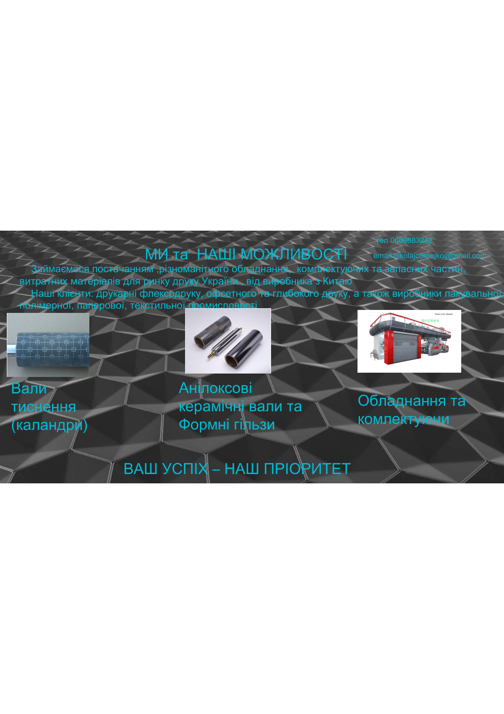
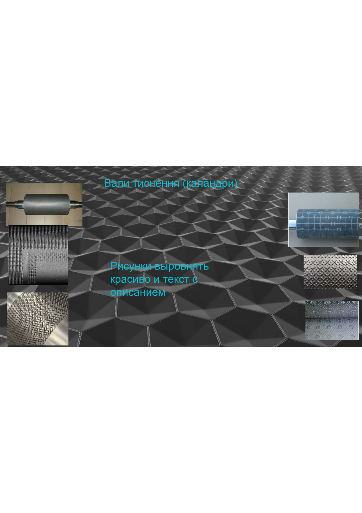
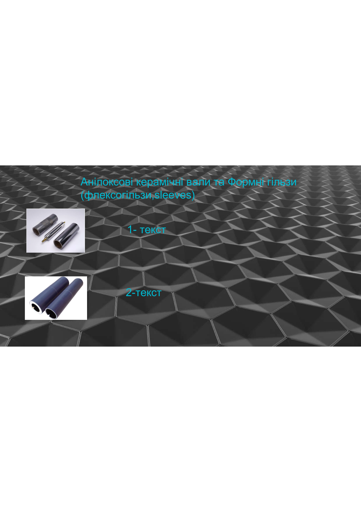
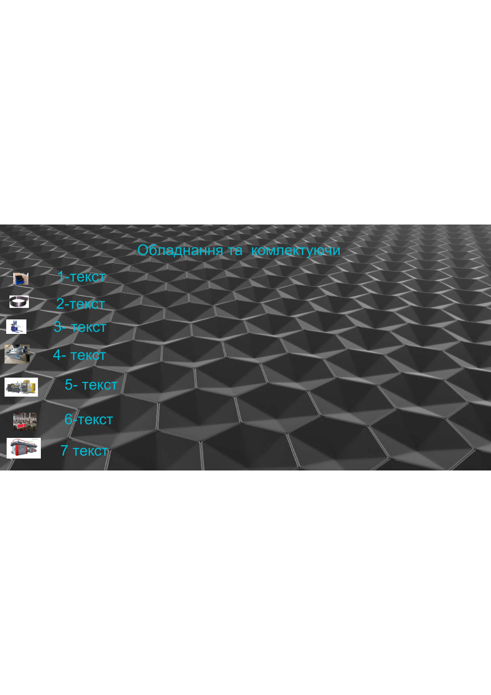

# КАРТА САЙТУ
## Nikolaj Корнейко — Обладнання для Друку

---

## ІНФОРМАЦІЯ ПРО ПРОЕКТ

| Параметр | Значення |
|----------|----------|
| **Тип проекту** | B2B корпоративний сайт + каталог |
| **Технологічний стек** | Django 5+, HTMX, PostgreSQL |
| **Цільова аудиторія** | Друкарні, дистриб'ютори, виробничі компанії |
| **Мови** | Українська |
| **Контакти** | +38 (066) 988-32-42, nikolajcornejko@gmail.com |
| **Слоган** | Ваш успіх – наш пріоритет |

---

## ДИСЦИПЛІНИ / КАТЕГОРІЇ ПРОДУКТІВ

Компанія спеціалізується на постачанні обладнання та комплектуючих для:
- **Друкарень** (флексографія, офсет, глибокий друк)
- **Виробників упаковки** (паперової, пластикової, полімерної)
- **Текстильної промисловості**

### 📌 КАТЕГОРІЯ 1: Вали тиснення (Каландри)

**Призначення:** Металеві циліндри для видавлювання текстури, візерунків, логотипів на рулонних і листових матеріалах

**Типи:**
- Сталь по сталі (максимальна чіткість малюнку)
- Сталь по гумі (для м'яких та еластичних матеріалів)
- Сталь по паперу (для серветок, туалетного паперу)

**Матеріали обробки:**
- Папір та картон
- Полімери та плівки
- Натуральна шкіра
- Метали та фольга
- Текстиль та неткані матеріали

**Основні параметри для фільтрації:**
- Діаметр вала
- Ширина вала
- Матеріал поверхні
- Тип тиснення

---

### 📌 КАТЕГОРІЯ 2: Анілоксові керамічні вали та Формні гільзи

**Призначення:** Вали для переносу фарби на друкарську форму (флексографія)

**Підкатегорія 2.1: Анілоксові вали**

**Типи:**
- Хромовані анілоксові вали
- Керамічні анілоксові вали

**Параметри підбору:**
- Фарба (яку використовуєте)
- Форма осередків (розмір та геометрія)
- Об'єм осередків (µl/см²)
- Лініатура анілоксового вала (lin/cm)

**Переваги кераміки:**
- Висока твердість матеріалу
- Щільне покриття
- Корозійна стійкість
- Точна передача чорнила
- Гладкі стінки осередків
- Легко чистити

---

**Підкатегорія 2.2: Формні гільзи (Sleeves)**

**Призначення:** Використовуються для наклейки флексоформ на робочу поверхню

**Матеріал:** Твердість 95 Sh.A

**Переваги:**
- Міцна полегшена конструкція
- Стабільність розмірів та стійкість до нагрівання
- Прискорюють та спрощують переналагодження тиражу

**Опціональні компоненти:**
- Монтажні смужки (стопорні кільця)
- Замки із нержавіючої сталі
- Розмітка: поздовжня (1, 2 або 4 смуги) та поперечна

**Параметри:**
- Товщина стінки: 3–100 мм
- Низька вага при високій жорсткості
- Широкий діапазон доступних розмірів
- Низьке осьове биття

---

### 📌 КАТЕГОРІЯ 3: Обладнання та Комплектуючи

#### 3.1 Щітки для чищення анілоксових валів

**Матеріал:** Сталевий дріт, акуратно встановлений та рівномірно розташований

**Переваги:**
- Ефективне очищення
- Не пошкоджує анілоксові вали
- Виготовлено з імпортної високоякісної сировини

---

#### 3.2 Ракельні ножі

**Призначення:** Дозування та передача фарби з форми на матеріал, що запечатується

**Параметри:**
- Товщина ножа: 0.15–0.20 мм
- Фінішне лезо у вигляді ламелі (для високої якості друку)
- Чим тонше ламель, тим чистіше знімає фарбу

---

#### 3.3 Електронні навантажувачі

**Вантажопідйомність:** 1000 кг / 1500 кг

**Застосування:** Переміщення котушок великого діаметра

**Особливості:**
- Усі органи керування розташовані на ручці
- Захист оператора від роздавлювання
- Захист ведучого колеса
- Блокування двигуна (гальмо стоянки)
- Клапан захисту від падіння (гідравлічні труби)
- Можливість оснащення бічним усуненням

**Технічні деталі:**
- Акумулятори з вбудованим зарядним пристроєм
- Тримач рулону плоский з гідравлічним керуванням
- Аварійний пристрій для зупинки машини

---

#### 3.4 Машина для ультразвукового миття анілоксових керамічних гільз

**Призначення:** Очищення засохлої фарби в комірках анілоксових валів (особливо при використанні водних фарб)

**Переваги:**
- Продовжує строк служби анілоксового вала
- Значно менше накопичується фарби при регулярному використанні
- Виконує качісне чищення, що неможливо досягти вручну

---

#### 3.5 Машина для склеювання та намотування рукава

**Призначення:** Формування термоусадочного етикетування

**Основні органи машини:**
- Розмотування
- Приведення
- Формування
- Склеювання
- Намотування
- Детектування

**Можна обробляти матеріали:** ПВХ, ПЕТГ, ОПС, ХІТ та інші типи плівки

**Характеристики:**
- Висока швидкість виробництва
- Ефективне прискорення та уповільнення
- Висока надійність автоматизації
- Інтегрована конструкція
- Відповідає стандартам промислової безпеки

---

#### 3.6 Пакеторобні машини

**Призначення:** Формування, зварювання, різання та виготовлення пластикових і паперових пакетів

**Матеріали:** ПНД, ПВД, ПП, папір

**Основні типи:**

| Тип | Застосування |
|-----|--------------|
| **Пакети «майка»** | Автоматичний виробничий пресс для формування ручок |
| **Пакети фасування** | Нарізування в рулонах (перфорація) або в стопках |
| **Пакети Wicket** | Упаковування хліба, курки, гігієнічних товарів |
| **Тришовні пакети та Doy-pack** | Упаковка зі стійким дном або зіп-замком |
| **Мішки для сміття** | Щільні мішки, часто з намотуванням та зав'язками |

---

#### 3.7 Флексографічні машини

**Призначення:** Друкарське обладнання для нанесення малюнка на рулонні матеріали рідкими швидковисихаючими фарбами

**Матеріали:** Плівка, папір, фольга

**Основні типи:**

| Тип | Опис | Застосування |
|-----|------|--------------|
| **Ярусна (Stack)** | Друковані секції розташовані один над одним | Простий друк, легко переналаштовується, найдешевше |
| **Планетарна (Central Impression)** | Всі секції навколо одного центрального циліндра | Тонкі розтягні плівки, висока точність поєднання кольорів |
| **Лінійна (In-line)** | Секції послідовно в одну лінію | Щільний картон, самоклеючі етикетки, вбудовування в екструдери |

---

## 🌳 СТРУКТУРА ВЕБОТАЙТУ

```
┌─────────────────────────────────────┐
│         ГОЛОВНА СТОРІНКА (Home)     │
├─────────────────────────────────────┤
│ • Логотип, контакти (тел., email)  │
│ • Героїчна секція + слоган          │
│ • CTA: Каталог, Зв'язатися          │
└─────────────────────────────────────┘
           ↓
┌─────────────────────────────────────┐
│      ОСНОВНІ РОЗДІЛИ САЙТУ          │
├─────────────────────────────────────┤
│                                     │
│ 1. ПРО КОМПАНІЮ (About)            │
│    • Коротка історія                │
│    • Клієнтська база                │
│    • Переваги роботи                │
│                                     │
│ 2. КАТАЛОГ (Catalog)               │
│    ├─ Вали тиснення                │
│    ├─ Анілоксові вали & Sleeves    │
│    └─ Обладнання & Комплектуючи    │
│                                     │
│ 3. ПОШУК & ФІЛЬТРИ (Search)        │
│    • Глобальний пошук               │
│    • Фільтри за параметрами         │
│    • Сортування                     │
│                                     │
│ 4. ПРАЙС-ЛИСТ (Pricing)            │
│    • Таблиця з артиклами            │
│    • Завантаження XLSX/PDF          │
│                                     │
│ 5. ТЕХНІЧНА ДОКУМЕНТАЦІЯ (Docs)    │
│    • Каталоги за категоріями        │
│    • Техспеції, таблиці             │
│    • Завантаження PDF               │
│                                     │
│ 6. КОНТАКТИ (Contact)              │
│    • Форма запиту                   │
│    • Телефон, Email                 │
│    • Карта (якщо є офіс)            │
│                                     │
│ 7. FOOTER                           │
│    • Навігація, контакти            │
│    • Соцмережі, Policies            │
│                                     │
└─────────────────────────────────────┘
```

---

## 📋 ДЕТАЛЬНА СТРУКТУРА КАТАЛОГУ

### **РОЗДІЛ 1: ВАЛИ ТИСНЕННЯ**

**URL:** `/products/pressing-rollers/`

**Елементи сторінки:**
- Заголовок та опис категорії
- Карточки продуктів у сітці (2–3 колони)
- Кожна карточка містить:
  - Зображення вала
  - Артикль
  - Назва / модель
  - Короткий опис
  - Основні параметри (таблиця)
  - CTA: «Запит коммерційної пропозиції»
  - Посилання на техдокументацію

**Фільтри:**
- За типом (Сталь-Сталь, Сталь-Гума, Сталь-Папір)
- За матеріалом обробки (Папір, Полімери, Шкіра, Метали, Текстиль)
- За розміром (діаметр, ширина)

**Сортування:**
- За назвою (A–Z)
- За популярністю
- За новизною

---

### **РОЗДІЛ 2: АНІЛОКСОВІ ВАЛИ & ФОРМНІ ГІЛЬЗИ**

**URL:** `/products/anilox-rollers/`

#### **Підрозділ 2.1: Анілоксові вали**
- Тип матеріалу (Хромовані vs Керамічні)
- Параметри: Лініатура, Об'єм, Форма осередків, Тип фарби
- Карточки з фото та специфікаціями

#### **Підрозділ 2.2: Формні гільзи (Sleeves)**
- Твердість (95 Sh.A)
- Варіанти розмітки
- Опціональні аксесуари
- Параметри: Товщина стінки, Розміри, Вага

---

### **РОЗДІЛ 3: ОБЛАДНАННЯ & КОМПЛЕКТУЮЧИ**

**URL:** `/products/equipment/`

**Групування (аккордеон / вкладки):**
1. Щітки для чищення
2. Ракельні ножі
3. Електронні навантажувачі
4. Машини для миття
5. Машини склеювання та намотування
6. Пакеторобні машини
7. Флексографічні машини

**Для кожного обладнання:**
- Детальне фото
- Параметри (потужність, швидкість, вага, вантажопідйомність)
- Характеристики та переваги
- Можливі матеріали обробки
- Посилання на техдокументацію
- Брошури та інструкції (PDF)

---

## 🔍 ГЛОБАЛЬНА СИСТЕМА ПОШУКУ ТА ФІЛЬТРАЦІЇ

### Пошукові поля:
- Назва продукту
- Артикль
- Опис
- Матеріал
- Параметри (розмір, потужність)

### Фільтри (динамічні, залежно від категорії):
- **Вали тиснення:** Тип, Матеріал, Розмір
- **Анілокси:** Лініатура, Об'єм, Форма, Тип фарби
- **Обладнання:** Вантажопідйомність, Потужність, Матеріали

### Сортування:
- За назвою (A–Z, Z–A)
- За популярністю
- За новизною
- За ціною (якщо додається потім)

### Умовиці:
- Фільтри зберігаються в URL параметрах
- AJAX оновлення результатів (HTMX)
- Показ кількості результатів

---

## 💰 СЕКЦІЯ ПРАЙС-ЛИСТ

**URL:** `/pricing/`

### Форма таблиці:
| Артикль | Найменування | Параметри | Вартість | Дія |
|---------|-------------|-----------|----------|-----|
| AX-0001 | Анілокс 150 lin | 150 lin/cm, 15 µl/см² | За запитом | Запит пропозиції |
| VT-0024 | Вал тиснення | Ø800 мм, ш. 500 мм | За запитом | Запит пропозиції |

### Функціональність:
- Вивантаження у форматі XLSX (Excel)
- Вивантаження у форматі PDF
- Кнопка «Запросити комерційну пропозицію» (форма модального вікна)
- Пошук по артиклу / назві

---

## 📥 ТЕХНІЧНА ДОКУМЕНТАЦІЯ

**URL:** `/docs/`

### Структура:
1. **Каталог 1:** Вали тиснення (PDF)
2. **Каталог 2:** Анілоксові вали та sleeves (PDF)
3. **Каталог 3:** Обладнання та комплектуючи (PDF)

### Функції:
- Категорійні вкладки / аккордеон
- Завантаження документів
- Дата оновлення, версія
- Опціонально: вбудований переглядач PDF

---

## 📞 КОНТАКТНА ФОРМА

**URL:** `/contact/`

### Поля форми:
```
[ Ваше ПІБ            ]
[ Компанія            ]
[ Email               ]
[ Телефон             ]
[ Категорія запиту    ] ← Dropdown:
                           • Консультація
                           • Замовлення
                           • Сервіс
                           • Рекламація
                           • Інше
[ Текст повідомлення  ]
[ Прикріпити файл     ] ← Optional

[ Відправити ]
```

### Обробка:
- Email надходить на: nikolajcornejko@gmail.com
- Автоматична відповідь клієнтові з номером заявки
- Логування всіх звернень у БД (для аналізу)

---

## 🎨 ДИЗАЙНОВІ РЕКОМЕНДАЦІЇ

### Палітра кольорів:
- **Основний:** Синій (#003D82)
- **Акцент:** Помаранчевий (#FF6B35)
- **Тло:** Білий / Світло-сірий (#F5F5F5)
- **Текст:** Темно-сірий (#333333)
- **Допоміжний:** Срібний (#E0E0E0)

### Типографія:
- **Заголовки (H1–H6):** Roboto, Bold / SemiBold
- **Тіло тексту:** Inter, Regular 16px
- **Моноспейс (для техспец):** Roboto Mono

### Адаптивність:
| Пристрій | Ширина | Лейаут | Меню |
|----------|--------|--------|------|
| Desktop | 1440px+ | 3 колони (де потрібно) | Горизонтальне |
| Планшет | 768–1439px | 2 колони | Бургер |
| Мобіль | 320–767px | 1 колона, вертикальний скрол | Бургер, повна адаптація |

**iOS Safari:** Тестування на малих екранах, edge-to-edge сумісність, безпека viewport

---

## 🛠️ ТЕХНІЧНА АРХІТЕКТУРА

### Backend
```
Django 5+, Python 3.12+
PostgreSQL
```

### Структура проекту (src/)
```
src/
├── config/               # Налаштування
│   ├── settings/
│   │   ├── base.py
│   │   ├── develop.py
│   │   ├── production.py
│   │   └── test.py
│   ├── urls.py
│   └── wsgi.py
│
├── products/             # Каталог товарів
│   ├── models.py
│   ├── views.py
│   ├── forms.py
│   ├── urls.py
│   └── templates/
│       ├── product_list.html
│       ├── product_detail.html
│       └── search_results.html
│
├── pricing/              # Прайс-лист
│   ├── models.py
│   ├── views.py
│   └── templates/
│       └── pricing_list.html
│
├── docs/                 # Технічна документація
│   ├── models.py
│   ├── views.py
│   └── templates/
│       └── docs_list.html
│
├── contact/              # Контакти та форма
│   ├── models.py
│   ├── forms.py
│   ├── views.py
│   ├── urls.py
│   └── templates/
│       └── contact_form.html
│
├── pages/                # Статичні сторінки
│   ├── views.py
│   └── templates/
│       ├── home.html
│       └── about.html
│
└── static/
    ├── css/
    │   ├── main.css
    │   ├── components/
    │   │   ├── header.css
    │   │   ├── card.css
    │   │   ├── table.css
    │   │   └── forms.css
    │   └── responsive/
    │       ├── tablet.css
    │       └── mobile.css
    ├── js/
    │   ├── main.js
    │   ├── search.js
    │   ├── filter.js
    │   ├── modal.js
    │   └── forms.js
    └── images/
```

### Frontend
- HTMX для інтерактивності
- Vanilla JS
- CSS BEM + CSS custom properties

### Deploy
- Docker + nginx + PostgreSQL
- DigitalOcean (або аналогічна платформа)

---

## ✅ ФАЗИ РОЗРОБКИ

### Фаза 1: Архітектура та Моделі (1–2 дні)
- [ ] Структура Django проекту
- [ ] Моделі (Product, Category, Specification, Price, Document, ContactMessage)
- [ ] Django Admin панель для управління даними
- [ ] Наповнення БД з документів

### Фаза 2: Frontend та Views (3–4 дні)
- [ ] Шаблони Jinja2 + HTMX
- [ ] Сторінка каталогу (фільтри, пошук)
- [ ] Сторінка деталей товару
- [ ] Прайс-лист та експорт
- [ ] Технічна документація
- [ ] Адаптивність (Desktop → Планшет → Мобіль, iOS Safari)

### Фаза 3: Контакти та CRM (1 день)
- [ ] Контактна форма з HTMX
- [ ] Email обробка
- [ ] Логування звернень у БД

### Фаза 4: Оптимізація та Deployment (1 день)
- [ ] SEO оптимізація (meta-tags, sitemap.xml, robots.txt)
- [ ] Кеш та compression
- [ ] Docker контейнеризація
- [ ] Розгортання на DigitalOcean

---

## 📸 ВИБІРКИ З ДОКУМЕНТІВ

Нижче наведені скриншоти з вихідних PDF документів:









---

## ЗАКЛЮЧЕННЯ

Цей документ описує повну карту веб-сайту для Nikolaj Корнейко. Сайт буде:

✅ **Професійний** — B2B дизайн, чистий інтерфейс  
✅ **Функціональний** — Каталог, пошук, фільтри, контакти  
✅ **Адаптивний** — Повна мобільна, планшетна та десктопна підтримка  
✅ **Швидкий** — Django + HTMX, без надмірних бібліотек  
✅ **Масштабований** — Легко розширюється на нові категорії товарів

**Готово до розробки!**

---

*Карта сайту версія 1.0 — Червень 2026*
